# 🏢 Birzeit Flat Rental System

A web-based apartment rental system developed as a project for the **Web Applications and Technologies** course at **Birzeit University**.

---

## 🔧 Project Status

🚧 **Project Completion: ~80%**

This system is mostly functional and includes features for:
- User registration and login
- Flat listing by owners
- Flat searching and renting by customers
- Manager review and approval for listed flats

> ⚠️ Some pages and functionalities still require polishing, debugging, and further testing.

---

## 🖥️ Technologies Used

- **Frontend**: HTML, CSS
- **Backend**: PHP
- **Database**: MySQL
- **Local Server**: XAMPP

---

## 👥 User Roles
- **Guest**: Browse listings
- **Customer**: Register, rent flats, manage basket
- **Owner**: List flats, view appointments
- **Manager**: Approve flats, respond to inquiries

---

## 📷 Screenshots

### 🔹 Guest & Login Pages
| Home Page | Login Page | Register Page |
|-----------|------------|----------------|
| 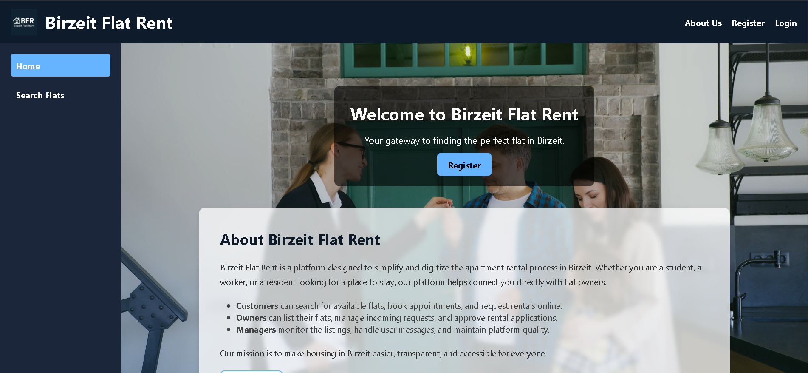 |  | 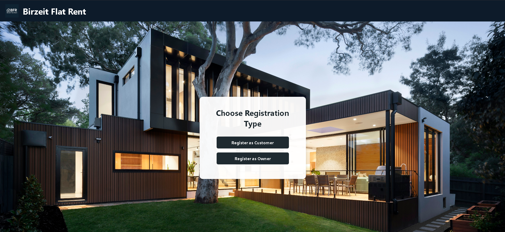 |

### 🔹 Customer Dashboard
| Register Step 1 | Step 2 | Rented Flats |
|------------------|--------|--------------|
| 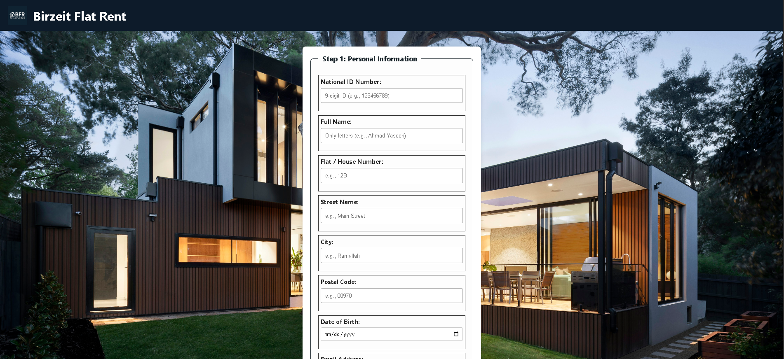 | 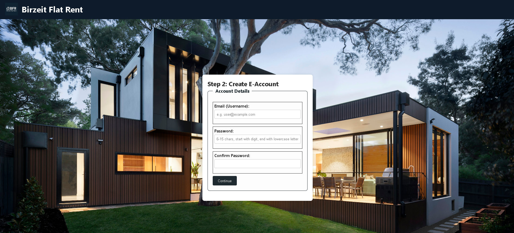 | 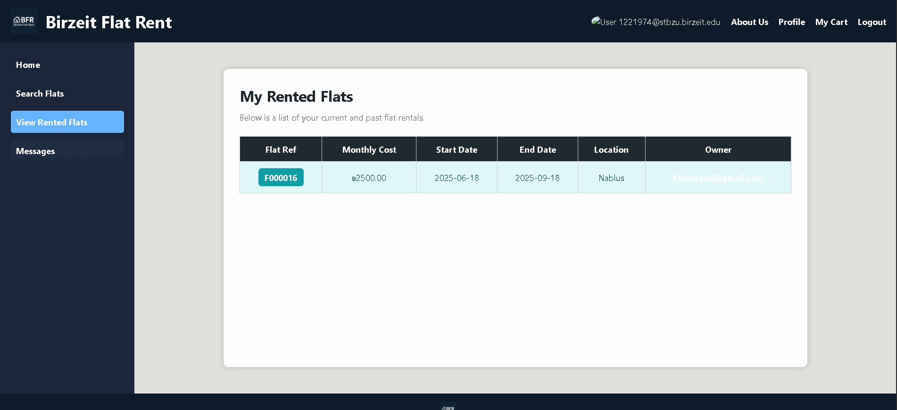 |

### 🔹 Owner Pages
| Home | Add Flat | Appointments |
|------|----------|--------------|
| 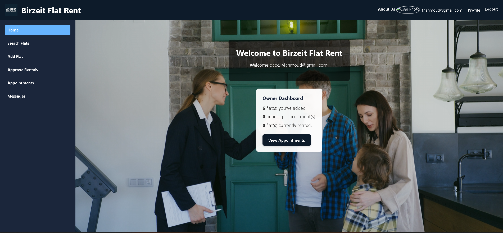 | 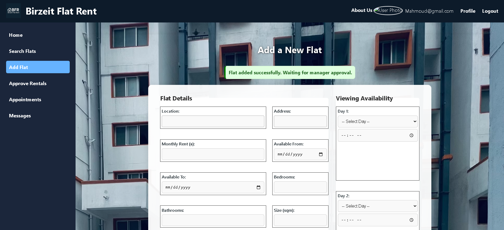 | 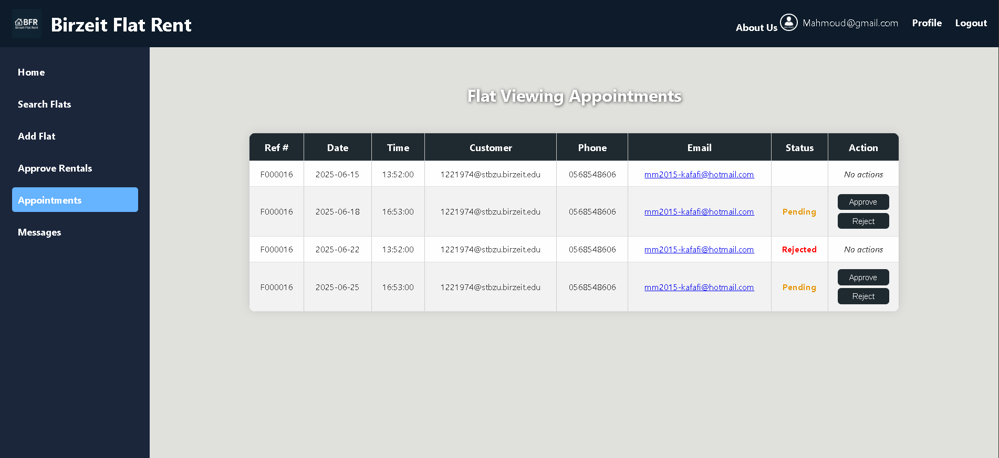 |

### 🔹 Manager Pages
| Home | Pending Flats | Search Inquiries |
|------|---------------|------------------|
| 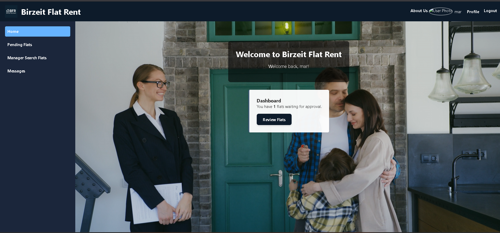 | 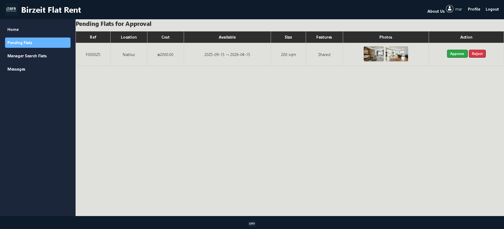 | 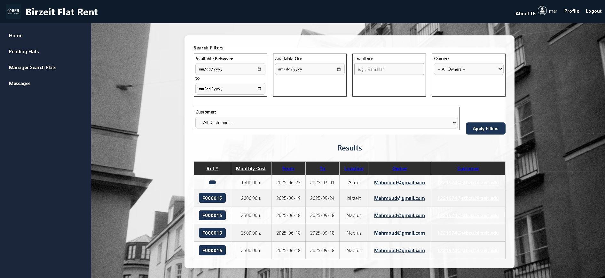 |

### 🔹 General Pages
| Flat Details | Basket | Confirm Rent | Messages |
|--------------|--------|---------------|-----------|
| 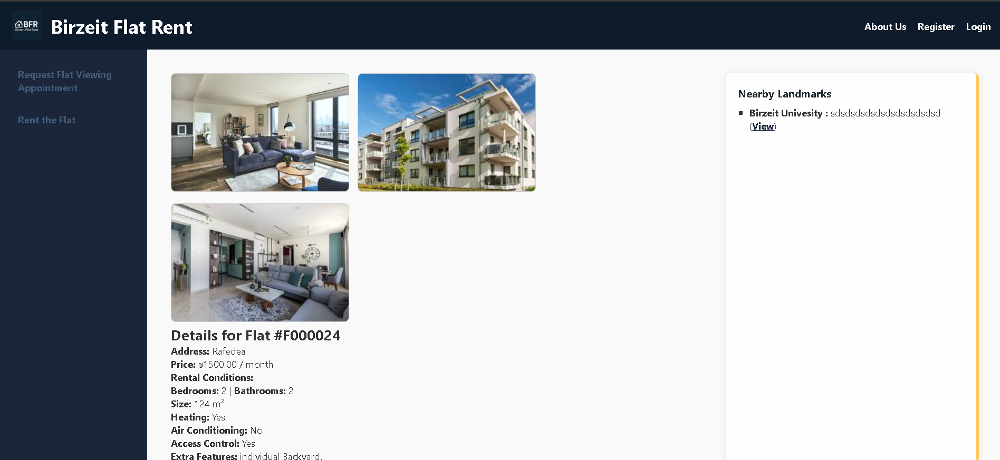 |  | 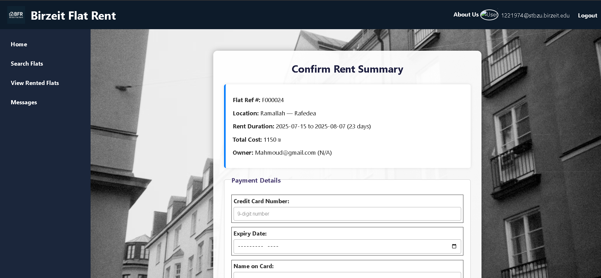 | 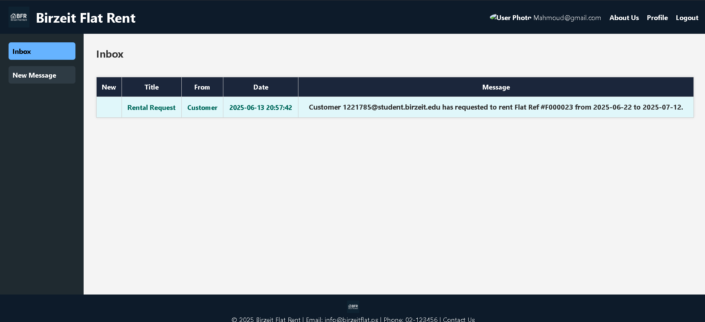 |

---

## 📂 How to Run
1. Install [XAMPP](https://www.apachefriends.org/index.html)
2. Place project files in the `htdocs` directory
3. Start Apache and MySQL via XAMPP
4. Import the provided SQL file in phpMyAdmin
5. Access via `http://localhost/<project_folder>`

---

## 📌 Notes
- Designed and implemented as a university assignment
- Still under improvement (some edge cases may not be handled)

---

## 👤 Author

**Mahmoud**  
Web Applications and Technologies – Birzeit University  
&copy; 2025 Mahmoud – All rights reserved
